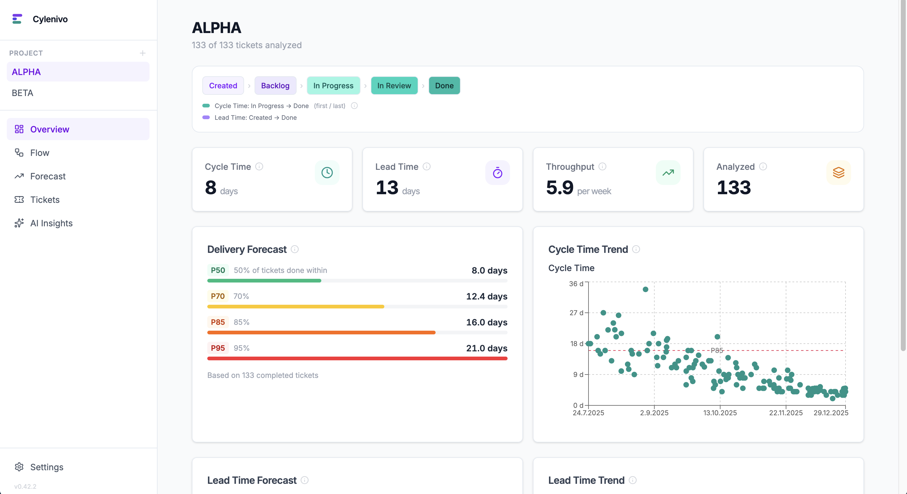

# Cylenivo

**[cylenivo.org](https://cylenivo.org)** — Download, screenshots and more.

Flow metrics for software teams — local, private, no accounts.

Import your Jira export and instantly see **Cycle Time**, **Lead Time**, **Throughput**, and **Monte Carlo delivery forecasts**. All data stays on your machine.



## Features

- **Cycle Time & Lead Time** — percentile distributions (P50/P70/P85/P95) with trend charts
- **Throughput** — completed tickets per week
- **Delivery Forecast** — Monte Carlo simulation: "How many tickets in N weeks?" or "When will N tickets be done?"
- **Flow breakdown** — Time in Status, Cycle Time by ticket type, Rework analysis
- **AI Insights** — connect your own Ollama or OpenAI-compatible model for narrative analysis
- **Multiple projects** — manage separate configs per team or workflow

## How it works

Cylenivo calculates metrics from **status transition timestamps**, not ticket fields. You configure which statuses mark the start and end of Cycle Time and Lead Time per project — no assumptions about your workflow.

## Data sources

| Source | Type | Notes |
|---|---|---|
| Jira | Built-in | CSV export or direct API connection |
| OpenProject | Community plugin | Via [cylenivo-plugins](https://github.com/nobsagile/cylenivo-plugins) |
| Any tool | Community plugin | [Build your own](https://github.com/nobsagile/cylenivo-plugins/blob/main/CONTRIBUTING.md) in ~50 lines of JS |

Plugins are installed directly inside Cylenivo — no manual file management.

## Getting started

Download the latest release for macOS or Windows from the [Releases](https://github.com/nobsagile/cylenivo/releases) page.

> **Note:** Cylenivo is not code-signed. macOS and Windows will show a security warning on first launch — this is expected.
>
> **macOS:** Right-click the `.dmg` → Open, then right-click the app → Open. Or go to System Settings → Privacy & Security → "Open Anyway" after the first blocked attempt.
>
> **Windows:** Click "More info" → "Run anyway" when SmartScreen appears.

To analyze your Jira data:
1. Export issues from Jira (CSV export with transitions, or connect via Jira API)
2. Create a configuration matching your workflow statuses
3. Import and explore

## Development

**Requirements:** Node 20+, [Bun](https://bun.sh), Rust (for Tauri)

```bash
npm install
cd server && bun install && cd ..
npm run tauri dev
```

Server tests:
```bash
cd server && npm test
```

Frontend tests:
```bash
npm test
```

## License

MIT + Commons Clause — free to use (including commercially), source-available.
Forks may not be sold or commercially redistributed. See [LICENSE](LICENSE) for details.

Copyright (c) 2026 Thomas Esders
